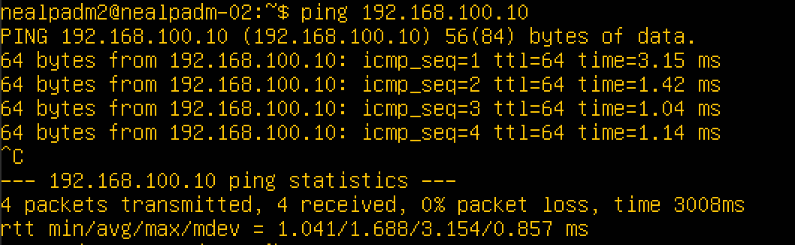
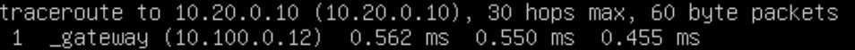
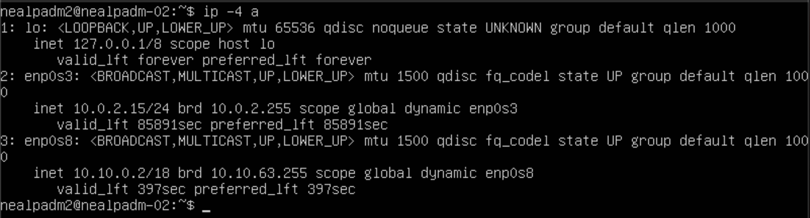

## Part 1. **ipcalc** tool

Installing the 'ipcalc' utility:


### 1.1. Networks and Masks

* network address of *192.167.38.54/13*


* conversion of the mask *255.255.255.0* to prefix and binary


*/15* to normal and binary, *11111111.11111111.11111111.11110000* to normal and prefix


* minimum and maximum host in *12.167.38.4* network with masks: */8*, *11111111.11111111.00000000.00000000*, *255.255.254.0* and */4*


### 1.2. localhost

The loopback address 127.0.0.1 typically uses the subnet mask 255.0.0.0, which is also known as the Class A subnet mask. This subnet mask is used to define the network portion and host portion of an IPv4 address. However, it's important to note that the subnet mask for the loopback address is not usually used or configured in most networking scenarios, as the loopback address is a special address that is used exclusively by the local machine to communicate with itself.

* can be accessed: 127.0.0.2, 127.1.0.1

* can't be accessed: 194.34.23.100, 128.0.0.1

### 1.3. Network ranges and segments

Public and private IP addresses are two different types of IP addresses used in network configurations.

Public IP addresses are used to identify devices on the global Internet. These addresses are unique and can only be used by one device on the network. Public IP addresses are only available through internet service providers (ISPs) and can be used to access resources on the Internet.

Private IP addresses are used in local networks, such as home networks and office networks. These addresses are not unique and can be used by multiple devices on the same network. Private IP addresses cannot be used to access resources on the global Internet.

There are three ranges of private IP addresses defined in the RFC1918 standard:

    10.0.0.0 - 10.255.255.255 (10/8 prefix)
    172.16.0.0 - 172.31.255.255 (172.16/12 prefix)
    192.168.0.0 - 192.168.255.255 (192.168/16 prefix)

Using private IP addresses allows devices on a local network to exchange information without needing to use public IP addresses and access servers on the Internet directly.

1) which of the listed IPs can be used as public and which only as private: *10.0.0.45*, *134.43.0.2*, *192.168.4.2*, *172.20.250.4*, *172.0.2.1*, *192.172.0.1*, *172.68.0.2*, *172.16.255.255*, *10.10.10.10*, *192.169.168.1*

private:
* 10.0.0.45
* 192.168.4.2
* 172.0.2.1
* 192.172.0.1
* 172.16.255.255
* 10.10.10.10 

public:
* 134.43.0.2 
* 172.20.250.4
* 172.68.0.2
* 192.169.168.1

2) which of the listed gateway IP addresses are possible for *10.10.0.0/18* network: *10.0.0.1*, *10.10.0.2*, *10.10.10.10*, *10.10.100.1*, *10.10.1.255*

possible:
* 10.10.0.1
* 10.10.10.2

impossible:
* 10.10.10.10
* 10.10.100.1
* 10.10.1.255

## Part 2. Static routing between two machines

* Start two virtual machines (hereafter -- ws1 and ws2)


* View existing network interfaces with the `ip a` command

``` 
ip a 
```
ws1


ws2


* Describe the network interface corresponding to the internal network on both machines and set the following addresses and masks: ws1 - *192.168.100.10*, mask */16 *, ws2 - *172.24.116.8*, mask */12*

ws1


ws2


### 2.1. Adding a static route manually

* Add a static route from one machine to another and back using a `ip r add` command and ping the connection between the machines

```
ip r add <address> dev enp0s8
```

ws1


ws2


### 2.2. Adding a static route with saving

* Restart the machines

```
reboot
```

* Add static route from one machine to another using *etc/netplan/00-installer-config.yaml* file

ws1


ws2


* Ping the connection between the machines

ws1


ws2


## Part 3. **iperf3** utility

```
sudo apt-get install iperf3
```

To measure the connection speed on one machine, you need to create a server, connect to it on the other.

ws1


ws2


#### 3.1. Connection speed

* Convert and write results in the report: 8 Mbps to MB/s, 100 MB/s to Kbps, 1 Gbps to Mbps
   * 8 Mbps = 1 MB/s
   * 100 MB/s = 800000 Kbps
   * 1 Gbps = 1000 Mbps

#### 3.2. **iperf3** utility
* Measure connection speed between ws1 and ws2

## Part 4. Network firewall

### 4.1. **iptables** utility

```
nano /etc/firewall.sh
```

ws1


ws2


***ping:***

ws1


ws2



The difference between the strategies applied in the ws1 and ws2 files lies in the order in which the permissive and forbidding rules are applied. In ws1, the forbidding rule is first set, and then the permissive rules follow. This means that all incoming packets will be discarded, except those that comply with the permissive rules (SSH, HTTP, ICMP). In ws2, the opposite happens - first a permissive rule is set, and only then there are forbidding rules. This means that all incoming packets will be accepted, except those that comply with the prohibiting rules (SSH, HTTP, ICMP).

Therefore, the ws1 machine is pinged because it has a strategy that allows ICMP traffic (iptables -t filter -A INPUT -p icmp -j ACCEPT), and the ws2 machine is not pinged because it uses a strategy that prohibits ICMP traffic (iptables -t filter -A INPUT -p icmp -j REJECT).

### 4.2. **nmap** utility

ws1


## Part 5. Static network routing

### 5.1. Configuration of machine addresses

ws11


ws21


ws22


r1


r2


```
ip -4 a
```

ping ws21 to ws22


ping ws1 to r1


### 5.2. Enabling IP forwarding.

```
sysctl -w net.ipv4.ip_forward=1
```

r1


r2


```
nano /etc/sysctl.conf
```

r1


r2


### 5.3. Default route configuration

Configured the default route (gateway) for workstations. To do this, we added default before the router's IP in the configuration file

r1


r2


ws11


ws21


ws22


ping ws11 to r2


### 5.4. Adding static routes

Added routes for routers:

r1


r2


Tables with routes on both routers.

r1


r2


```
ip r list 10.10.0.0/18
ip r list 0.0.0.0/0
```
ws1


The default route has a lower priority and is triggered when a suitable route is not found in the routing table. We have created a rule for the 10.10.0.0 network, and the created route is used accordingly. You can also set a metric to change route priorities.

### 5.5. Making a router list

```
sudo apt-get install traceroute
```

Building a list of routers on the path from ws11 to ws21:




The principle of building a path using traceroute:
To identify intermediate routers, traceroute sends a series of data packets to the target node, while each time increasing by 1 the value of the TTL ("lifetime") field. This field usually indicates the maximum number of routers that can be traversed by a packet. The first packet is sent with a TTL equal to 1, and therefore the first router returns an ICMP message indicating that data cannot be delivered. Traceroute records the address of the router, as well as the time between sending a packet and receiving a response (this information is displayed on the computer monitor). Then traceroute repeats sending the packet, but with a TTL equal to 2, which allows the first router to skip the packet further.
The process is repeated until, at a certain TTL value, the packet reaches the target node. When a response is received from this node, the tracing process is considered completed.

### 5.6. Using **ICMP** protocol in routing

Ping a non-existent IP from ws11 (for example, 10.30.0.111)


## Part 6. Dynamic IP configuration using **DHCP**

```
sudo apt install isc-dhcp-server
```

For r2, configure the configuration of the DHCP service in the /etc/dhcp/dhcpd.conf file:

1) Specify the default router address, DNS server and internal network address.
<center>

 

</center>

2) In the resolv.conf file, we write nameserver 8.8.8.8.

<center>

 

</center>

3) Restart the DHCP service with the systemctl restart isc-dhcp-server command. We reboot the ws21 machine using reboot

<center>

 

</center>

4) Ping ws22 with ws21

<center>

 
 

</center>

We repeat the same for r1, only with the binding of the ip address to the mac address.

<center>

 

</center>

1) Specify the default router address, DNS server and internal network address.
<center>

 

</center>

2) In the resolv.conf file, we write nameserver 8.8.8.8.

<center>

 

</center>

3) Restart the DHCP service with the systemctl restart isc-dhcp-server command. We reboot the ws11 machine using reboot

<center>

 

</center>

4) Ping ws11 with ws22

 
 

ws21 before ip address update:

 

ws21 after ip address update:

 

The '-r' flag indicates the release of the IP address. When the command is executed with this flag, the DHCP client informs the DHCP server that it no longer needs the received IP address and releases it.

## Part 7. **NAT**

In the /etc/apache2/ports.conf file on ws22 and r1, we change the line Listen 80 to Listen 0.0.0.0:80, that is, we make the Apache2 server public

ws22

 

r1


```
service apache2 start
```

We added the following rules to the firewall, created by analogy with the firewall from Part 4, on r2:

1) deleting rules in the filter - iptables -F table
2) deleting rules in the "NAT" table - iptables -F -t nat
3) drop all routed packets - iptables --policy FORWARD DROP


ping r1 to ws22:


Added another rule to the file:

4) allow routing of all ICMP protocol packets


ping r1 to ws22:


Added two more rules to the file:

5) enable SNAT, namely masking of all local ip from the local network located behind r2 (according to the designations from Part 5 - network 10.20.0.0)

6) enable NAT on port 80 of the r2 machine and add access from outside the network to the Apache web server running on ws22


Test SNAT:


Test DNAT:


## Part 8. Bonus. Introduction to **SSH Tunnels**

Firewall from part 7:


Run the Apache web server on ws22 only on localhost (i.e. in the /etc/apache2/ports.conf file, change the line Listen 80 to Listen localhost:80)


```
service apache2 start
```

We used Local TCP forwarding from ws21 to ws22 to access the web server on ws22 from ws21:

```
ssh -L [local_port]:localhost:80 [remote_ip]
```


Test:


We used Remote TCP forwarding cws11 to ws22 to access the web server on ws22 from ws11:

```
ssh -R [remote_port]:localhost:80 [remote_ip]
```


Test:


